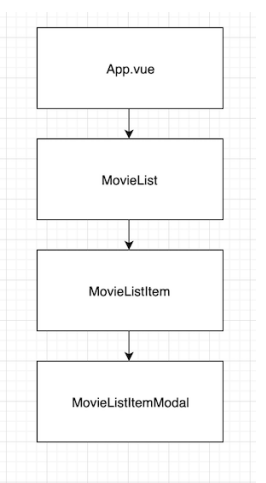
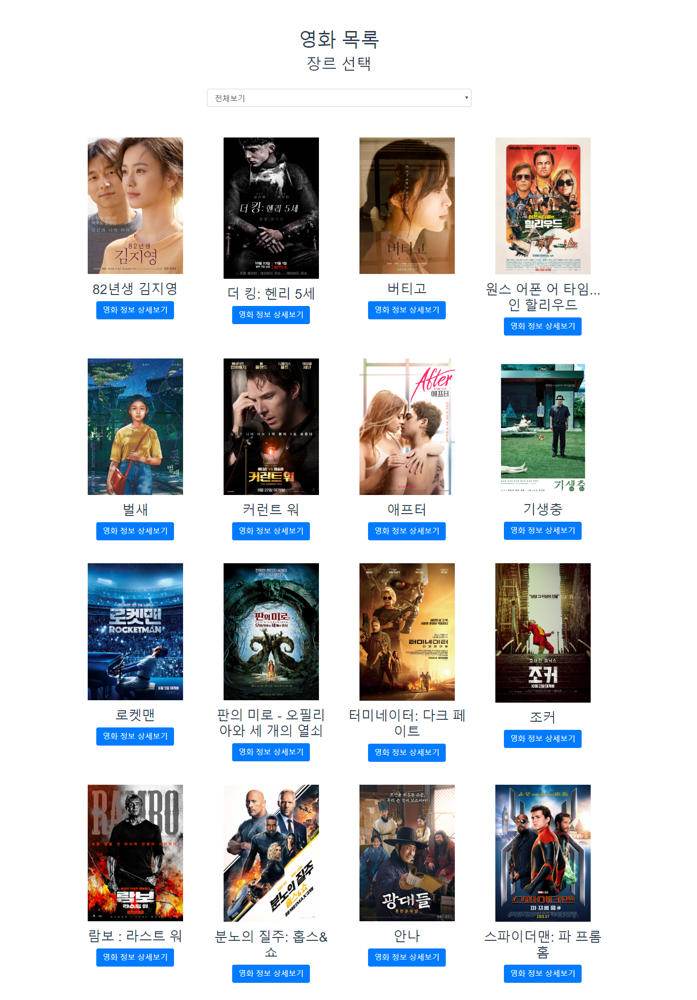
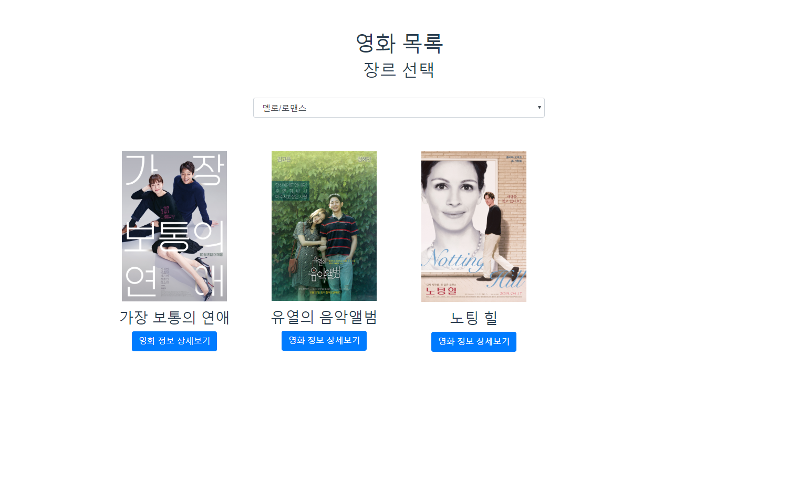

# project 09

## component 구조




### App.vue

<hr>

```javascript
mounted() {
    // 0. mounted 되었을 때, 
    // 1) 제시된 URL로 요청을 통해 data의 movies 배열에 해당 하는 데이터를 넣으시오. 
    // 2) 제시된 URL로 요청을 통해 data의 genres 배열에 해당 하는 데이터를 넣으시오.
    // axios는 위에 호출되어 있으며, node 설치도 완료되어 있습니다.
    const MOVIE_URL = 'https://gist.githubusercontent.com/sy7979/5d2edfa3f0d0d598906a4e1255f58006/raw/1335851eb414504aca30f1cdab58148f505e0d94/movie.json'
    axios.get(MOVIE_URL)
      .then((response) => {
        
        this.movieData = response.data
      })
      .catch((error) => {
        console.log(error)
      })
  
    const GENRE_URL = 'https://gist.githubusercontent.com/sy7979/ddd308f553f9c6d959e730ff98a7f431/raw/2a6aabc6ae7d378e237df44b3784e971bb09e682/genre.json'
    axios.get(GENRE_URL)
      .then((response) => {
      
        this.genreData = response.data
      })
      .catch((error) => {
        console.log(error)
      })
  },
}
```

axios를 활용하여 데이터 gist에서 받아오고 데이터에 넣어주기


```vue
<template>
  <div id="app">
    <div class="container">
      <!-- 1-3. 호출하시오. 
        필요한 경우 props를 데이터를 보내줍니다.
      -->
      <MovieList v-bind:movieDataFromApp="movieData" v-bind:genreDataFromApp="genreData"/>
    </div>
  </div>
</template>
```

axios에서 받아온 데이터를 자식 `component`인 `MovieList`에 전달해주기


### MovieList.vue

<hr>

```html
<select class="form-control" v-model="genreDataX">
    <option value="">전체보기</option>
    <option v-for="genreData in genreDataFromApp" v-bind:key="genreData.id" v-bind:value="genreData.id">
        {{genreData.name}}
    </option>
</select>
```

받아온 `genreDataFromApp`으로 항목값을 넣어주고 `value`를 활용해서 각 데이터의 `id` 값으로 `v-model="genreDataX"`로 바꿔준다.


```javascript
computed: {
    movieDatas: function(){
      if (this.genreDataX === ''){
        return this.movieDataFromApp
      } else {
        return this.movieDataFromApp.filter( (m)=>{
          return m.genre_id === this.genreDataX
        })
      }

    }
  }
```

`movieDatas`: for문을 통해서 `MovieListItem`에 넘겨줄 값을 `genre_id`에 따라서 변경시키기 위해서 `filter`를 활용해준다.


### MovieListItem.vue

<hr>

```html
<template>
  <div class="col-3 my-3">
    <!-- img 태그에 src와 alt값(영화제목)을 설정하시오 -->
    
    <!-- 영화 제목을 출력하시오. -->
    <h3>{{movieDataFromList.name}}</h3>
    <!-- 모달을 활용하기 위해서는 data-taget에 모달에서 정의된 id값을 넣어야 합니다. -->
    <button class="btn btn-primary" data-toggle="modal" v-bind:data-target="'#movie-' + movieDataFromList.id">영화 정보 상세보기</button>
    <!-- 1-3. 호출하시오.
      필요한 경우 props를 데이터를 보내줍니다.
      -->
    <MovieListItemModal v-bind:movieDataFromItem="movieDataFromList"/>
    
  </div>
</template>


########################################## MovieListitemModal.vue
<template>
  <!-- vue 콘솔에서 확인하여, 추가 정보들도 출력하세요. -->
  <!-- 고유한 모달을 위해 id 속성을 정의하시오. 예) movie-1, movie-2, ... -->
  <div class="modal fade" tabindex="-1" role="dialog" v-bind:id="'movie-'+movieDataFromItem.id">
.
.
.
```

`modal`을 연결시키기 위해서는 `data-target`에 연결시키려는 모달의 id `#id` or class `.class`로 연결시켜준다. 다만 `html ` 문법에 의해서 숫자만을 사용한 id값은 허용하지 않기 때문에 `String`과 연결시켜준다.


## 결과

### screenshot





### 느낀점

작은 에러라도 넘어가지 않고 바로 해결해야한다. 서버 구동에 문제가 없어서 오류를  무시하고 넘어갔더니 프로젝트 진행 후반부에 문제가 발생했다. 문제의 이유를 파악하기 어려워서 해결하는데 시간이 많이 걸렸다.